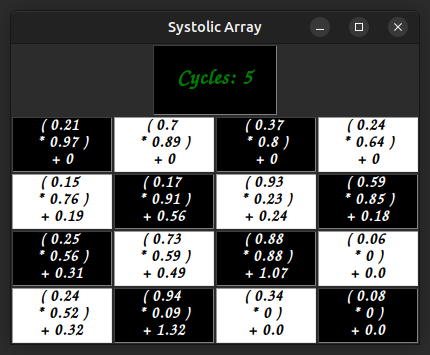
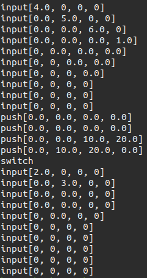

# SystolicArraySimulator
The following repository contains the source code for a systolic array based matrix multiply unit. The Punit is designed using verilog, while the matrix multiply unit is built in python, by providing inputs for the Punits via an iput file. In addition to this a python based script is provided to split the matrix if it's larger than the systolic array and then offset and load the input matrices, and finally remove the offsets and merge the output matrices. The instructions (Input matrix, Push weights, Switch buffered weights) to the matrix multiply unit are saved in the file instructions.ss. Further the simulator counts the number of clock cycles required to perform an entire matrix multiply operation using the systolic array. 

Apart from the basic matrix multiply operation, the python script also includes a provision to convert convolution operations to matrix multiply operations and perform them. Finally a GUI based frontend is also provided to watch the multiply operations in real time.

### GUI Frontend of the simulator 
 
### Generated Instructions file 
